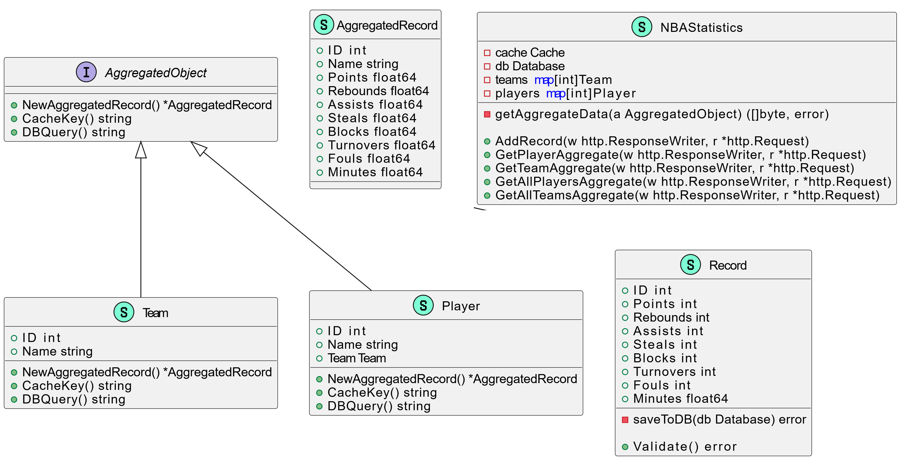

## NBA Statistics
- A scalable system for NBA player's statistics
- The system runs on GitHub Codespaces
- Code written entirely in Golang
- Project delivered using Kubernetes
- A relational PostgreSQL database is used

## Examples of Use

### Add a New Record
```sh
curl -X POST https://laughing-memory-x5wxvr5rgpv529wv-8080.app.github.dev:8080/record \
    -H "Content-Type: application/json" \
    -d '{
         "player_id": 1,
         "points": 30,
         "rebounds": 10,
         "assists": 5,
         "steals": 2,
         "blocks": 1,
         "turnovers": 3,
         "fouls": 2,
         "minutes": 35.5
        }'
```

### Get Player Aggregate Statistics
```sh
curl -X GET "https://laughing-memory-x5wxvr5rgpv529wv-8080.app.github.dev:8080/aggregate/player?playerId=1"
```

### Get Team Aggregate Statistics
```sh
curl -X GET "https://laughing-memory-x5wxvr5rgpv529wv-8080.app.github.dev:8080/aggregate/team?teamId=1"
```

### Get All Players Aggregate Statistics
```sh
curl -X GET https://laughing-memory-x5wxvr5rgpv529wv-8080.app.github.dev:8080/aggregate/players
```

### Get All Teams Aggregate Statistics
```sh
curl -X GET https://laughing-memory-x5wxvr5rgpv529wv-8080.app.github.dev:8080/aggregate/teams
```

## Application Architecture

### Load Balancer
A single entry point [https://laughing-memory-x5wxvr5rgpv529wv-8080.app.github.dev/](https://laughing-memory-x5wxvr5rgpv529wv-8080.app.github.dev/) that distributes incoming HTTP requests across multiple instances of the Go application.

### Golang Application
- Packaged and deployed in Docker containers; runs in several pods
- Uses connection pooling to PostgreSQL
- Integrates with a Redis caching layer

### Caching Layer (Redis)
- Stores frequently accessed or recently computed average values to reduce database load
- Ensures quick reads without always hitting the DB for the same queries

### PostgreSQL Database
- Primary store for records
- A Goose migration tool is used to handle schema changes

### Orchestration & Deployment
- Containers are orchestrated via Kubernetes
- Multiple replicas of the app run behind the load balancer
- Rolling updates for zero-downtime deployments: Kubernetes will start new pods with the updated version, then gracefully shut down old pods once the new ones pass health checkspplication Architecture

## High-Level Architecture Diagram
                      ┌───────────────────────┐
                      │  Client / Third-Party │
                      │    (e.g., other apps) │
                      └─────────┬─────────────┘
                                │
                      ┌─────────▼─────────┐
                      │   Load Balancer   │
                      │                   |
                      └─────────┬─────────┘
                                │
               ┌───────────────────────────────────────┐
               │               Kubernetes              │
               │                                       │
               └───────────────────────────────────────┘
                                │
                ┌───────────────┴────────────────┐
                │                                │
       ┌────────▼────────┐              ┌────────▼────────┐
       │ Go App Pod      │              │ Go App Pod      │
       │ (Container)     │              │ (Container)     │
       └────────┬────────┘              └────────┬────────┘
                │                                │
                │              ┌─────────────────┴───────────────────┐
                │              │          Caching Layer (Redis)      │
                └─────────────►│   (Caching aggregated query results)│
                               └─────────────────────────────────────┘
                                         │
                                         │
                               ┌───────────────────┐
                               │PostgreSQL Cluster │
                               │                   │
                               └───────────────────┘


## Class Diagram


## Implementation Considerations
- **Load Balancing**: A load balancer is required to distribute incoming requests across multiple app instances, ensuring even workload distribution and high availability

- **Caching**: distributed cache (Redis) is better to use to ensure the most actual data to be accessible from multiple app instances; pre-prepared cache data may appear superfluous. 

- **DB Architecture**: with only tens or hundreds of requests concurrently, a well-tuned single instance (or a tightly coupled high-availability cluster) should suffice without read-only replicas to avoid complexity (synchronization, potential consistency issues, failover management).

- **Parallel Read/Write Queries**: PostgreSQL uses MVCC (Multi-Version Concurrency Control) by default, so the concurrent aggregative SELECTs typically will not be blocked by INSERTs, and the newly committed rows are visible to subsequent queries right away.

- **Migrations**: blue-green or canary deployments will be selected to facilitate frequent live updates and migrations without downtime

## Next Steps
- Ensure uniqueness of records by game date
- Make mechanisms for archiving the data from previous seasons
- Implement app graceful shutdown
- Improve error handling
- Add extensive logging based on ELK
- Add metrics gathering and monitoring based on Prometheus/Grafana
- Add unit and integration tests
- Configure several app pods and load balancer
- Create enchanced Helm templates
- Implement user authentication and authorization
- Secure Redis access
- Store passwords in K8 secrets
- Set up continuous integration and continuous deployment (CI/CD) pipelines

